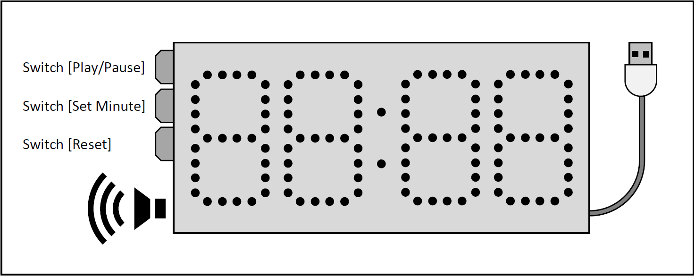

# Countdown Timer
A portable countdown timer powered by USB port. Use Arduino to control it.  
  

# Power Supply
A standard USB type-A port that supply voltage with 5V and current more than 1A.  
Such as a common mobile power.
# Control
This device has 3 switches to control all functions.  
1. Setup Mode  
- [Reset]: Set time to 0.  
- [Set Minute]: Short click to add 1 minute, Long click to add 10 minutes continuously.  
- [Play/Pause]: Start countdown timer. (Switch to counting mode)  
2. Counting Mode  
- [Play/Pause]: Stop countdown timer. (Switch to setup mode)  
- [Reset] and [Set Minute] are locked.  
When countdown to “00:00”, speaker will sing a melody 3 times and show “End” on display then back to setup mode.
# More...
For more details, please check PDF document in this project.
